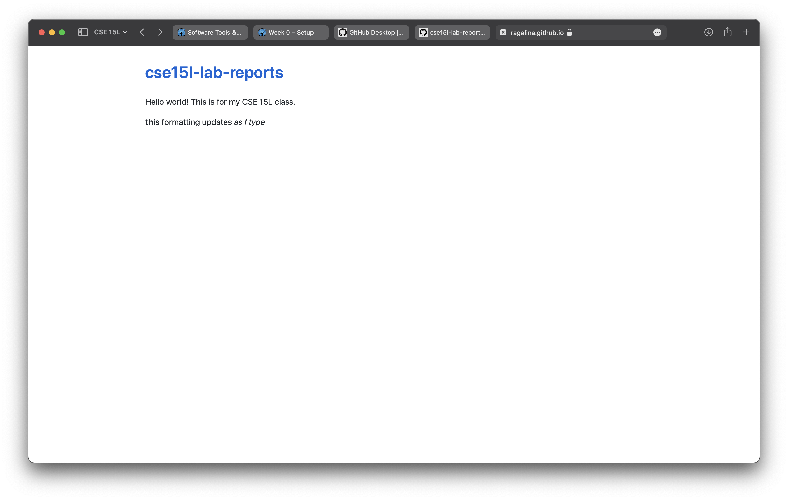

## Week 0 - Setup

This is an image of my initial website.

>Now I'm testing...
> - **bold**
> - _italics_, which could also be done with *asterisks*
> - unordered lists
> - and block quotes!

1. I could also use 
2. ordered lists
    1. with indents 

Here is a code block: 

    <html>
    <body>
        <h1>Test</h1>
    </body>

[This](https://ragalina.github.io/cse15l-lab-reports/test.html) is where I tested what markdown files do 

