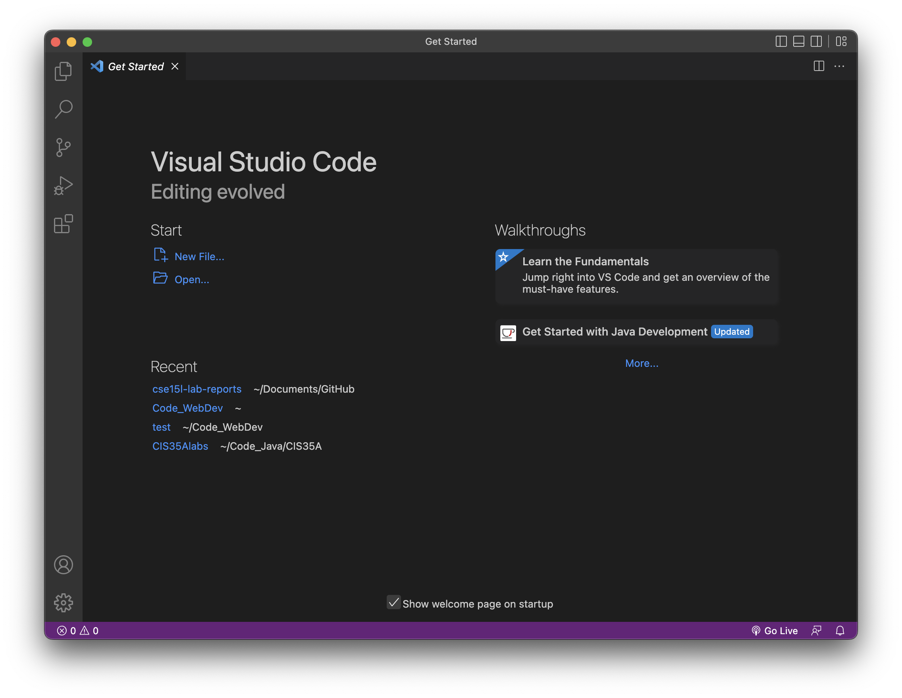
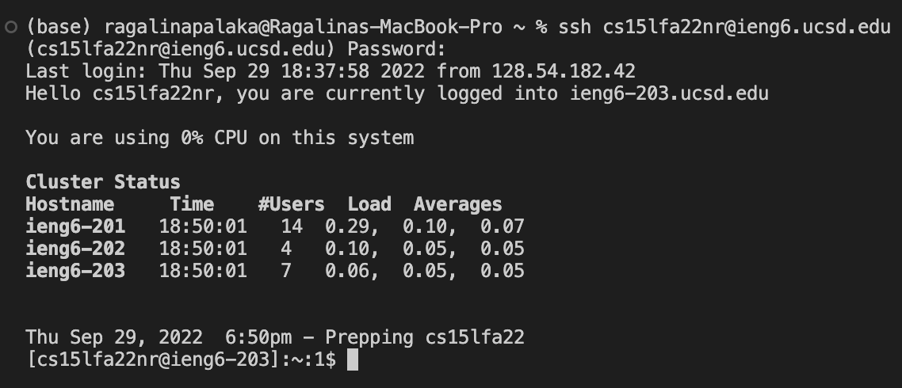
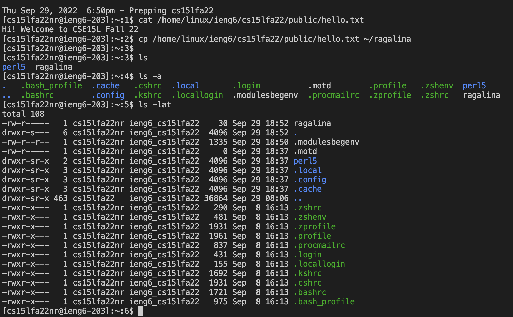
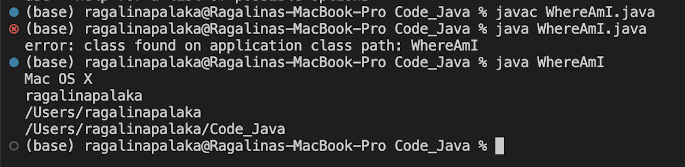
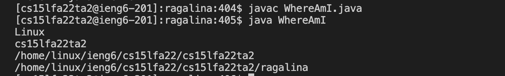
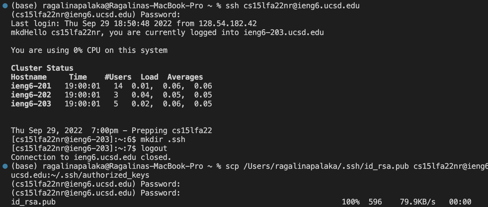
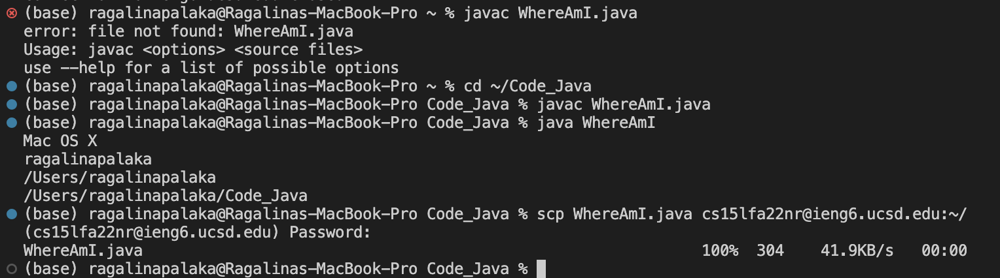

This blog post will serve as a tutorial for using our course account to remotely access ```ieng6```.

Steps
1. [Install Visual Studio Code](#download-visual-studio-code)
2. [Remotely Connecting](#remotely-connecting)
3. [Running Basic Commands](#running-basic-commands)
4. [Moving Files with ```scp```](#moving-files-with-```scp```)
5. [Setting SSH Keys](#setting-ssh-keys)
6. [Making Remote Running *Even* Easier](#making-remote-running-*even*-easier)

## Download Visual Studio Code 


I already had VS Code installed on my laptop, so I simply launched the application. 

## Remotely Connecting
Use the [Account Lookup](https://sdacs.ucsd.edu/~icc/index.php) to find your CSE 15L username. It should look like "cs15lfa22xx", with the xx being any two random letters.  After finding your username, reset your password. Keep it simple, since you won't be able to see what you're typing into the terminal! Once your password is reset (this can take 15-60 minutes), login to your account via the terminal. 

The command is:
    
    ssh cs15lfa22nr@ieng6.ucsd.edu

Once prompted, enter your password. If the password doesn't work, try typing it somewhere else and copy-pasting it into the terminal (make sure you don't copy-paste any extra spaces).

You should then see this text:


The 201, 202, & 203 refer to the 3 computers that you can log in to. The number of users may vary when compared to when others logged in, but the load averages are fairly consistent between people.

## Run Some Commands
After you log in, try running some commands in the remote system!

Here is what I tried:


- ```cat /home/linux/ieng6/cs15lfa22/public/hello.txt```:  prints a .txt file that is stored remotely 

- ```cp /home/linux/ieng6/cs15lfa22/public/hello.txt~/ragalina```: copies that remotely-stored file to my personal laptop

- ```ls```: lists the files and directories in the current directory

- ```ls -a```: shows both hidden and normal files

- ```ls -lat```: provides more information on each file

- ```ctrl + D```: this logs you out

## Moving Files with ```scp```

To copy files from your personal device to your account on the remotely-accessed computer, we use the ```scp``` command. The full command is:

    scp filename.java cs15lfa22nr@ieng6.ucsd.edu:~/

The ```~/``` copies the file to the home directory. To move it to a subfolder, enter the filename after ```/```. 

After entering this, you'll have to sign in with your password. Once you use ```ssh``` to login again, you should see the file listed. To test this out, I created a practice java file, WhereAmI.java.

    class WhereAmI {
    public static void main(String[] args) {
        System.out.println(System.getProperty("os.name"));
        System.out.println(System.getProperty("user.name"));
        System.out.println(System.getProperty("user.home"));
        System.out.println(System.getProperty("user.dir"));
    }
    }

When run on my personal device, this is WhereAmI.java's output:



Here is the output from the remote system:


The ```.getProperty``` function in WhereAmI.java shows the different operating systems and locations of the file on the client vs. the server.

## Setting SSH Keys
To make logging in and copying files faster, you can save your password in ssh keys. The public key file is stored on your remote-access account while the private one is stored on your personal device. When both of these files can be found, they can serve as a substitute for the password. 

Here is the code I ran:


The key commands were:
- ```ssh-keygen```: generates the files for the key pair
- ```mkdir .ssh```: after logging in, make a ```.ssh folder``` on your remote account. This will contain the public key file.
- ```scp /Users/ragalinapalaka/.ssh/id_rsa.pub cs15lfa22nr@ieng6.ucsd.edu:~/.ssh/authorized_keys```: copies the public key file (```id_rsa.pub```) to the ```.ssh folder``` on the remote account.

The files were saved in their default location, a .ssh file. At the end, after I entered my password, the ```id_rsa.pub``` means that the command was successful.

## Making Remote Running *Even* Easier

You can minimize the number of keystrokes needed by simply using the up arrow to go to the previous command. Additionally, to reduce the number of commands you need to run, you can chain the commands together with ```;```. For example:

    javac WhereAmI.java; java WhereAmI

In this screenshot, updating the WhereAmI.java file, compiling, running, and copying it to the remote system would only take 10 keystrokes — 1 to save the file, and 3 up-arrows for each following command.




