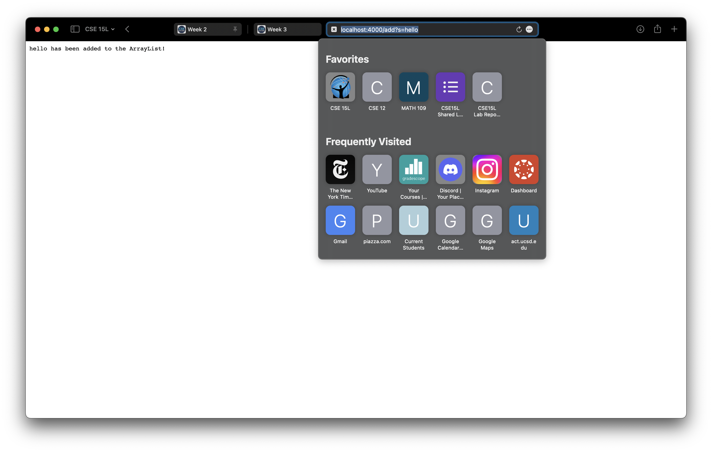

1. [Part 1](#searchengine.java)
2. [Part 2](#bugs)

## SearchEngine.java
Here is my code for ```SearchEngine.java```.

    import java.util.ArrayList;
    import java.net.URI;
    import java.io.IOException;

    class Handler implements URLHandler {
        ArrayList<String> strings = new ArrayList<>();

        public String handleRequest(URI url) {
            if (url.getPath().contains("/add")) {
                String[] parameters = url.getQuery().split("=");
                if (parameters[0].equals("s")) {
                    strings.add(parameters[1]);
                    return (String.format(parameters[1] + " has been added to the ArrayList!"));
                }
                return "";
            } else if (url.getPath().contains("/search")) {
                String[] parameters = url.getQuery().split("=");
                String returnSearch = "This search returns: ";
                if (parameters[0].equals("s")) {
                    String term = parameters[1];
                    for (String str : strings) {
                        if (str.contains(term)) {
                            returnSearch += str + ", ";
                        }
                    }
                }
                return returnSearch;
            } else {
                return "404 Not Found!";
            }
        }
    }

    class SearchEngine {
        public static void main(String[] args) throws IOException {
            if(args.length == 0){
                System.out.println("Missing port number! Try any number between 1024 to 49151");
                return;
            }

            int port = Integer.parseInt(args[0]);

            Server.start(port, new Handler());
        }
    }

```SearchEngine.java``` basically uses data from the query section of the url to add items to an ArrayList of strings or to search within the the ArrayList of strings. Here are examples of it in use:


In ```handleRequest```, the only cases we account for are where the URL path contains "add" or "search". Since the empty, default path contains neither — ```url.getPath()```  = "" — the code enters the else loop and returns "404 Not Found!" as an error message. 

 
This is an example of how we add a string to the ArrayList in the search engine. ```url.getPath()``` = "/add" and ```url.getQuery()``` = "?s=hello". Since the path contains "/add", the code enters the first if statement, where the query is split by the equals sign. Thus, "s=hello" turns into ["s", "hello"]. Since the first element is "s", the code enters the if statement and the second element is added to the ArrayList and a confirmation message is printed. 

As a summary:
- After the if statement, ```parameters``` = ["s", "hello"]
- ```strings``` is an empty array before the query is processed, but after, ```strings``` = {"hello"}

This process was repeated for "unicorn", "jello", and "mellow", so that the final ```strings``` ArrayList contains 4 items — {"hello", "unicorn", "jello", "mellow"}.


In this screenshot, we're searching the ArrayList for strings that contain "ello". ```url.getPath()``` = "/search", and ```url.getQuery()``` = "s=ello". Like with the add function, the code enters an else-if loop because the URL contains "search". The query is then split at the "=" to create ```parameters```, an array of strings with the values ["s", "ello"]. In the loop, since ```parameters[0]``` is s, the string we're searching for, ```term``` is set to ```parameters[1]```. Then, the code loops through the ArrayList of strings to see which contain ```term```. If any are found, they are added to the string (```returnSearch```) that is returned and displayed on the website. 

As a summary:
- After the if statement, ```parameters``` = ["hello", "unicorn", "jello", "mellow"]
- ```returnSearch``` = "This search returns: " at the beginning but is updated to be "This search returns: hello, jello, mellow, "

## Bugs
In ```ArrayExamples.java```, the ```reversed``` method had a bug. 

The original code: 

    static int[] reversed(int[] arr) {
        int[] newArray = new int[arr.length];
        for(int i = 0; i < arr.length; i += 1) {
            arr[i] = newArray[arr.length - i - 1];
        }
        return arr;
    }
  
This was the failure-inducing input: 

    public void testReversedMultipleInput() {
        int[] input1 = {1, 2, 3, 4, 5};
      assertArrayEquals(new int[]{5, 4, 3, 2, 1}, ArrayExamples.reversed(input1));
    }

This was the symptom: 

    arrays first differed at element [0]; expected:[5] but was:[0] at ArrayTests testReversedMultipleInput(ArrayTests.java:29)

The bug was ```arr[i] = newArray[arr.length - i - 1];```, since it was setting the initial array equal to the newArray, which had only been initialized with zeroes. The correct code is ```newArray[arr.length - i - 1] = arr[i];```, which would update the newArray with the correct reversed value. Then, newArray would be returned. 

The bug caused this symptom because instead of arr's contents being reversed, they were just replaced with zeroes. The input was {1, 2, 3, 4, 5}, so the expected output was [5, 4, 3, 2, 1], but the actual output was {0, 0, 0, 0, 0}.

In ```Lists.java```, the ```filter``` method had an issue with how objects were added to the final ArrayList. 

The original code: 

    static List<String> filter(List<String> list, StringChecker sc) {
        List<String> result = new ArrayList<>();
        for(String s: list) {
            if(sc.checkString(s)) {
                result.add(0, s);
            }
        }
        return result;
    }

This was the failure-inducing input: 

    public void testListFilter() {
        List<String> test = new ArrayList<>(Arrays.asList("hello", "pineapple", "sheep", "goat"));
        StringChecker CA = new checkA();
        ListExamples listEx = new ListExamples();
        String[] expected = {"pineapple", "goat"};

        assertArrayEquals(expected, listEx.filter(test, CA).toArray());
    }

This was the symptom: 

    arrays first differed at element [0]; expected:[[pineapple]] but was:[[goat]]
    at ListTests.testListFilter(ListTests.java:24)

The bug was ```result.add(0, s)``` because the method specifications said that the items that passed the filter should have been added to the ArrayList in the same order they originally were in. However, by adding each selected element at index 0, the method reversed the order. The input was {"hello", "pineapple", "sheep", "goat"}, so the output should have been {"pineapple", "goat"}, but instead, it was {"goat", "pineapple"} because "goat" was added at index 0. To fix the code, I replaced ```result.add(0, s)``` with ```result.add(s)```. Not specifying an index means that the item is automatically added to the end. 


